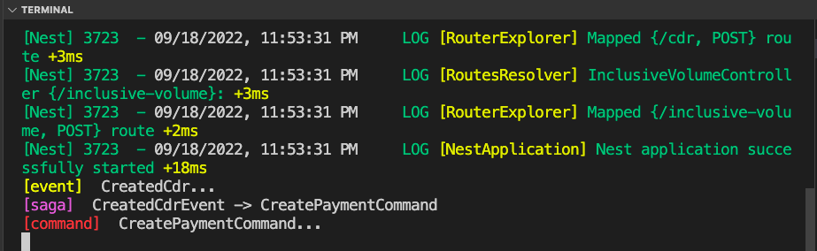
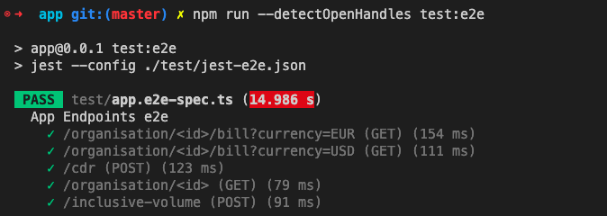

# Billing API Pay As You Go / Inclusive Volume
Billing API for SIM calls. 

# To Start:
- install docker
- `docker-compose up` 

# CQRS
By using the event sourcing design pattern when a new call detail(Cdr) comes, new event is triggered, The saga catches this event and then trigger a command to do payment.


# Tests
isolated E2e test cases were implemented, run using command:
```npm run test:e2e```


- test pre-requirements: `docker-compose up testdb -d` 

--------------

## Assumptions:  
- Each cdr price has to be calculated right away as the price may change in the rate entity, and the client has to pay for the current price.
- Cdrs come in big numbers and high rate, and new code could be added in the future when creating new cdr
- to be safe from changing in currency prices, all payments should be stored in one default currency, this currency stored as env variable (`DEFAULT_CURRENCY`), and then when query a bill in different currency the new price will be calculated based on this currency.

### Future Improvements: 
- **add DB isolation level(Transaction) to avoid dirty read on the inclusive-volume**
- Use UUID instead of real DB ID, to not show DB info to the client, no coupling with the DB.
- Relation between organisation and volume should be 1-* in the future not 1-1, with active field, in which only one volume is active.
- Using AuthGuards, for example only specific user roles can create inclusive volume..etc
- I used lightweight CQRS just as example on using event sourcing in this app, so implemented it just with cdr creating, later, all changes to the db should be in commands to get the benefits from reusing it in the future 

